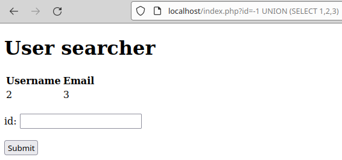

# Confidential statement

This document is the exclusive property of `<CLIENT COMPANY NAME>` and `<NAME OF ASSESSING COMPANY>` containing sensitive, privileged, and confidential information. Precautions should be taken to protect the confidentiality against duplication, redistribution or use, avoiding reputational damage to `<CLIENT COMPANY NAME>` or facilitating attacks against `<CLIENT COMPANY NAME>`.

`<NAME OF ASSESSING COMPANY>` shall not be liable for any damages that the use of this information may cause.

# Disclaimer

The service/s performed to the client are considered a snapshot in time of `<CLIENT COMPANY NAME>`'s environment. The findings and recommendations reflect the information gathered during the assessment and not any changes or modifications made outside of that period.

Finally, note that this assessment may not disclose all vulnerabilities present on the systems within the scope of the engagement that could appear in the future. This report contains the findings from a specific point-in-time made on `<CLIENT COMPANY NAME>`' s environment. 

# Executive summary

## Synopsis

*`<NAME OF ASSESSING COMPANY>` was hired by `<CLIENT COMPANY NAME>` to provide the service/s of `<SERVICE/S>` to specific systems. When performing the `<SERVICE>`, there ware several alarming vulnerabilities that were identified in the company's network.`<NAME OF ASSESSING COMPANY>` was able to extract all the data from a public database and perform Remote Code Execution through the web application.*

## Observed security strengths

[...]

## Overall Risk rating

*The overall risk identified to `<CLIENT COMPANY NAME>` as a result of the penetration test is \textcolor{high}{High}. This rating implies an ELEVATED risk of security controls being compromised with the potential for material financial losses, based on two high-risk and several medium vulnerabilities.*

# Technical report

## Scope

The scope for the footprinting phase was all the `<CLIENT COMPANY NAME>` public information that a user could find on the Internet.

The scope for the pentesting and vulnerability assessment services were the following systems:

* localhost (127.0.0.1)
* https://example.org/

## Footprinting

 In this section, a number of items should be written up to show the CLIENT the extent of public and private information available through the execution of the Information gathering phase. The information could be classified ad:

* Passive
* Active
* Corporate
* Personal

## Pentesting | Vulnerability assessment

### Localhost - 127.0.0.1

* **Ports (TCP)**: 22, 80
* **Operating system**: Linux

During the web enumeration phase was discovered a company's user searcher, which retrieves information about an employee based on the user company's id.

#### Union SQL Injection

Union-based SQL injection allows an attacker to extract information from the database by extending the results returned by the original query.

* CVSS Base Score: 9.8
* Criticality: \textcolor{high}{High}

`<NAME OF ASSESSING COMPANY>` identified a Union SQL injection on the web page as can be seen below.



[...]

Finally, `<NAME OF ASSESSING COMPANY>` was able to obtain the admin's credentials with the following payload.

```bash
http://localhost/index.php?id=-1%20UNION%20(SELECT%20id,%20email,%20password%20from%20users%20where%20id=1)
```


##### Mitigations

`<NAME OF ASSESSING COMPANY>` recommends patching the vulnerability by using prepared SQL statements with parameterized queries, user input validation and enforcing the principle of least privilege.

# HOUSE CLEANING

During a penetration testing engagement, tools, files, user accounts, etc., were created on the client's environment which would compromise the client's security.
After the completion of the engagement, `<NAME OF ASSESSING COMPANY>` ensures that remnants of the test are removed. 

# Appendix

## Changes during the test

[...]

## Risk rating Scale

| Risk                           | Description                                                  |
| ------------------------------ | ------------------------------------------------------------ |
| \textcolor{critical}{Critical} | The vulnerability poses an immediate threat to the organization. Successful exploitation may permanently affect the organization. Remediation should be immediately performed. |
| \textcolor{high}{High}         | The vulnerability poses an urgent threat to the organization, and remediation should be prioritized. |
| \textcolor{medium}{Medium}     | Successful exploitation is possible and may result in notable disruption of business functionality. This vulnerability should be remediated when feasible. |
| \textcolor{low}{Low}           | The vulnerability poses a negligible/minimal threat to the organization. The presence of this vulnerability should be noted and remediated if possible. |

