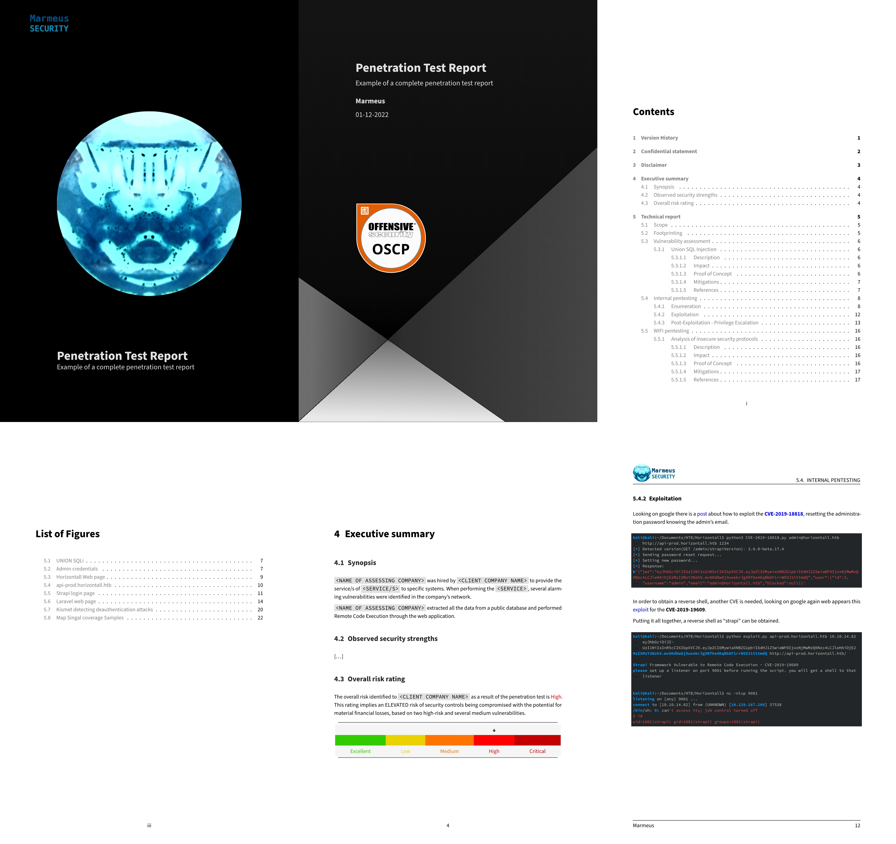

# Pentest & OSCP report

This repository contains the requirements, templates and the script to convert a markdown pentest or OSCP report into a PDF file that can be sent directly to the client or to Offensive Security. Furthermore, I have added two title pages, configurable on the markdown file, so you can choose the best title page that adapts to your needs.



# Requirements

Before executing the `generate.sh` your Kali Linux machine needs some packages that are not installed by default. In order to obtain them, execute the script `requirements.sh`.

# Things you need to know

## Line of code not splitting in code blocks

It might be the case where you execute a long string, or you have a long output from a command that doesn't contain any spaces. In those cases, pandoc doesn't know where to split de line, so it keeps a huge line that exists in the PDF. To avoid this problem, the number of characters per line must not exceed 95. Hence, after 95 characters without space, you need to put a space.

## Pandoc image resizing

Since Pandoc renders images at page width by default, some images come out really big, depending on the aspect ratio of the original image. This could be solved by using something like `{ width=250px height=100px}` in your original MarkDown file.

## Error with Header 5

The `\leavevmode` and `\newline` are necessary because Pandoc from h5 onwards puts both the header and the following text on the same line. 

```bash
#####  H5 
\leavevmode \newline
```

## Inline code syntax highlighting

If you want your inline code to have syntax highlighting, which I don't encourage, you must write it like so.

```bash 
`print("HELLO")`{.bash}
```

### Break page

In this template, if you want to immediately start writing on a new page, you need to write `\newpage`.

## `\` usage

Instead of simply writting `\`, write `\textbackslash`.

## References to sections in the document

In the section you want to referenciate, after the title section write `\label{<SECTION_NAME>}`. Then, to referenciate the section write `\ref{<SECTION_NAME>} \nameref{<SECTION_NAME>}`

## Latex template

If you have any doubt about the parameters at the top of the Markdown files, go to the [Eisvogel latex template repository](https://github.com/Wandmalfarbe/pandoc-latex-template).

# Usage

In order to generate your PDF file, just do the following.

```bash
./generate.sh <INPUT MAKRDOWN PATH> <OUTPUT PDF FILE>
```

If the compilation has been successful, the PDF file will open.


# To Dos

- [ ] Add a frame to only images in the report. This [solution](https://tex.stackexchange.com/questions/349918/image-frame-borders-in-pdf-from-latex-template-with-pandoc-markdown) puts a frame on every single image, so it the images on the title page will also have a frame.
